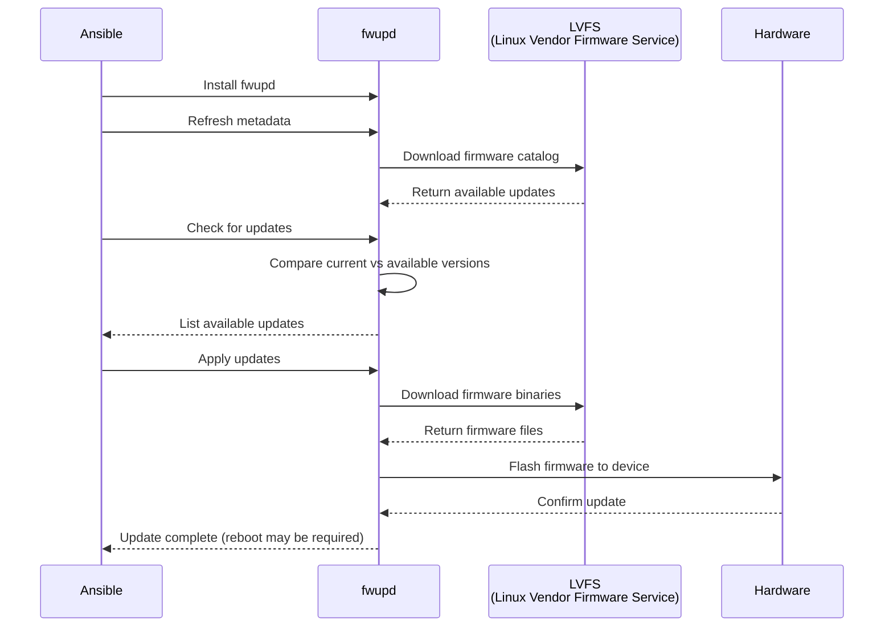

# Firmware Updates Role

Ansible role for monthly firmware updates on lab laptops using Ubuntu's built-in
`fwupd` tool.

## Purpose

- **Problem:** Laptop firmware gets outdated, causing bugs, hardware issues, and
  security gaps
- **Solution:** Monthly automated firmware checks and updates across all lab
  laptops
- **Benefit:** Consistent firmware versions, reduced troubleshooting, improved
  security

## Requirements

- Ubuntu/Debian-based Linux
- Root/sudo privileges
- Internet connection (to download firmware from LVFS)
- Supported hardware with fwupd-compatible firmware
- **IMPORTANT: Laptop lids must be OPEN during firmware updates**
  - UEFI firmware updates fail when lid is closed
  - Coordinate with team to physically open lids in lab before running updates

## What It Does

1. Installs `fwupd` (Linux Vendor Firmware Service client)
2. Refreshes firmware metadata from LVFS (Linux Vendor Firmware Service)
3. Checks for available firmware updates
4. Applies updates automatically
5. Generates detailed report with before/after device information
6. Notifies if reboot is required

## How fwupd Works



## Supported Devices

`fwupd` supports firmware updates for:

- **UEFI/BIOS** - System firmware (Lenovo, Dell, HP, etc.)
- **Thunderbolt** - Controllers and docks
- **USB-C** - Hubs and docking stations
- **NVMe** - SSDs and storage controllers
- **Embedded Controllers** - Laptop EC firmware
- **TPM** - Trusted Platform Module
- **Network Cards** - Intel, Realtek, etc.

Not all devices support `fwupd`. Check compatibility: `fwupdmgr get-devices`

## Usage

### Include in Playbook

```yaml
- name: Monthly Firmware Updates
  hosts: lab
  become: true

  roles:
    - role: firmware_updates
```

### Run Monthly Update Playbook

**RECOMMENDED: Complete workflow in one command**

```bash
# Setup
source .venv/bin/activate

# Run complete workflow (check → apply → reboot → verify)
ansible-playbook playbooks/12-lab-firmware-full.yml --tags firmware-full \
  --ask-pass --ask-become-pass

# Options
--tags firmware-check     # Check for updates only
--tags firmware-apply     # Apply updates only
--tags firmware-reboot    # Reboot and verify only
--limit <hostname>        # Single host
-e use_lan_fallback=true  # LAN fallback (when VPN is down)
```

**Alternative: Step-by-step approach**

```bash
# Step 1: Dry run to check for updates
ansible-playbook playbooks/10-lab-firmware-check.yml --check --diff --ask-pass --ask-become-pass

# Step 2: If updates available, coordinate with team to OPEN LAPTOP LIDS in lab
#         (firmware updates fail when lids are closed)

# Step 3: Apply updates (after lids are open)
ansible-playbook playbooks/10-lab-firmware-check.yml --ask-pass --ask-become-pass

# Step 4: Reboot to apply firmware (if updates were installed)
ansible-playbook playbooks/11-lab-firmware-reboot.yml --ask-pass --ask-become-pass
```

## Role Variables

```yaml
# Enable automatic updates (default: true)
firmware_auto_update: true

# Force metadata refresh (default: true)
firmware_force_refresh: true

# Assume yes to prompts (default: true)
firmware_assume_yes: true

# Skip reboot check (default: true)
firmware_no_reboot_check: true

# Log directory (default: /var/log/firmware-updates)
firmware_log_dir: /var/log/firmware-updates
```

## Output

### Update Report

Generated at: `/var/log/firmware-updates/YYYYMMDD-HHMMSS-hostname.md`

Contains:

- Date and operator
- Hardware information
- Update status (available/applied/failed)
- Firmware devices before update
- Firmware devices after update
- Reboot requirement
- Next steps

### Example Report

```markdown
# Firmware Update Report

**Date:** 2026-01-10 15:30:00 **Hostname:** example-lab-01 **Hardware:**
ThinkPad P15 Gen 2i **Operator:** user1

---

## Update Status

**Updates Available:** YES **Updates Applied:** YES

### Updates Applied

Successfully updated System Firmware from 1.29 to 1.30 Successfully updated
Thunderbolt Controller from 89.00 to 90.00

⚠️ **REBOOT REQUIRED**

---

## Next Steps

1. Reboot the system to apply firmware changes
2. After reboot, verify: fwupdmgr get-devices
3. Update firmware log with new versions
```

## Monthly Process

### 1. Assign Monthly Owner

Rotate ownership each month:

- **January:** Engineer A
- **February:** Engineer B
- **March:** Engineer C
- etc.

### 2. Run Update (First Week of Month)

Owner runs the complete workflow playbook:

```bash
ansible-playbook playbooks/12-lab-firmware-full.yml --tags firmware-full \
  --ask-pass --ask-become-pass
```

**Note:** Currently reboots all hosts simultaneously. When EKS-A cluster is
running, uncomment `serial: 1` in playbook to reboot nodes one at a time
(maintains cluster availability).

### 3. Review Report

Check generated report for:

- Updates applied successfully
- Any failures or errors
- Reboot requirements

### 4. Reboot if Required

If firmware updates were applied:

```bash
sudo reboot
```

### 5. Verify After Reboot

```bash
fwupdmgr get-devices
```

Check firmware versions match expected versions.

### 6. Update Firmware Log

Update `docs/FIRMWARE_UPDATE_LOG.md` with:

- Date of update
- Operator name
- Devices updated
- New firmware versions
- Any issues encountered

## Manual Commands

### Check Available Updates

```bash
# Refresh metadata
sudo fwupdmgr refresh

# Check for updates
sudo fwupdmgr get-updates

# List all devices
sudo fwupdmgr get-devices
```

### Apply Updates Manually

```bash
# Update all devices
sudo fwupdmgr update

# Update specific device
sudo fwupdmgr update <device-id>
```

### Check Update History

```bash
# View update history
sudo fwupdmgr get-history

# View device details
sudo fwupdmgr get-device-flags
```

## Troubleshooting

### No Updates Available

**Normal** - Not all hardware releases firmware updates monthly.

**Action:**

- Log that check was performed
- Schedule next monthly check
- No further action needed

### Update Failed

**Common Causes:**

- Device in use (close applications)
- Insufficient battery (plug in AC adapter)
- Conflicting drivers
- Network issues downloading firmware

**Action:**

1. Check logs: `journalctl -u fwupd`
2. Retry: `sudo fwupdmgr update`
3. Report issue if persistent

### fwupd Not Installed

**Fix:**

```bash
sudo apt update
sudo apt install fwupd fwupd-signed
```

### Device Not Supported

**Check:**

```bash
sudo fwupdmgr get-devices
```

If device shows `UpdateState: Unknown` or is not listed, firmware updates may
not be available for that hardware.

## Security

- **Signed Firmware:** All firmware downloaded from LVFS is cryptographically
  signed
- **Vendor Verification:** fwupd verifies firmware signatures before flashing
- **No Downgrades:** fwupd prevents installing older firmware versions
- **Rollback Protection:** Some devices support automatic rollback on failure

## Files and Directories

| Path                         | Description                 |
| ---------------------------- | --------------------------- |
| `/var/log/firmware-updates/` | Update reports and logs     |
| `/var/lib/fwupd/`            | fwupd database and metadata |
| `/etc/fwupd/`                | fwupd configuration         |
| `/usr/share/fwupd/`          | Installed firmware updates  |

## Resources

- **fwupd Documentation:** https://fwupd.org/
- **LVFS (Firmware Repository):** https://fwupd.org/lvfs/
- **Ubuntu fwupd Guide:** https://wiki.ubuntu.com/FirmwareUpdates
- **Internal:** [Firmware Update Log](../../../docs/FIRMWARE_UPDATE_LOG.md)
