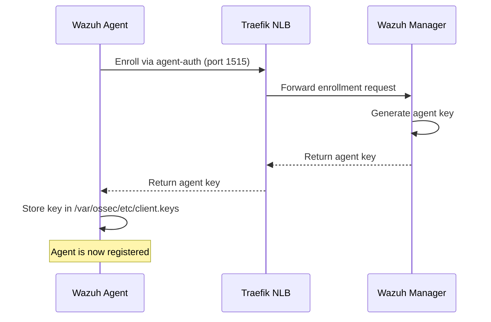
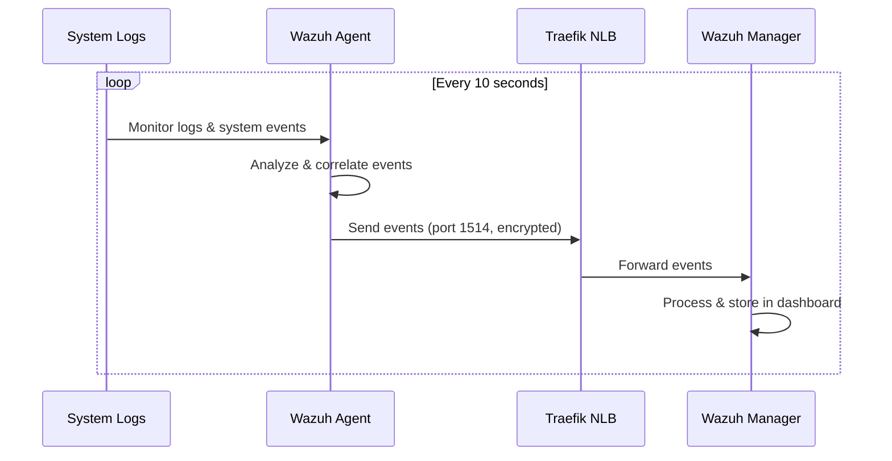

# Wazuh Agent Role

Shared Ansible role for installing and configuring the Wazuh agent on Linux
systems. Agents connect to Wazuh manager via Traefik NLB and send security
events, logs, and system inventory data.

## Requirements

- Linux (Ubuntu/Debian/RHEL/CentOS/Fedora/Amazon Linux)
- Architecture: ARM64 (aarch64) or AMD64 (x86_64)
- Network access to Wazuh manager (ports 1514, 1515 via Traefik NLB)
- Root/sudo privileges

## Supported Platforms

| OS Family | Distributions                      | Architectures |
| --------- | ---------------------------------- | ------------- |
| Debian    | Ubuntu, Debian                     | ARM64, AMD64  |
| RedHat    | RHEL, CentOS, Fedora, Amazon Linux | ARM64, AMD64  |

## Role Variables

### Required

None - defaults work for standard deployments.

### Optional

```yaml
# Wazuh manager connection (defaults to sbx via Traefik NLB)
wazuh_manager_address: "wazuh.example.com"
wazuh_manager_port: 1514
wazuh_manager_enrollment_port: 1515

# Agent identification
wazuh_agent_name: "{{ inventory_hostname }}" # Uses hostname by default

# Agent version
wazuh_agent_version: "4.14.1-1"

# Agent behavior
wazuh_agent_notify_time: 10 # Time between agent checks (seconds)
wazuh_agent_time_reconnect: 60 # Time before reconnection attempts (seconds)

# Capabilities (enable/disable features)
wazuh_sca_enabled: true # Security Configuration Assessment
wazuh_syscollector_enabled: true # System inventory collection
wazuh_rootcheck_enabled: true # Rootkit detection
wazuh_vulnerability_detection_enabled: true # Vulnerability scanning
wazuh_openscap_enabled: false # OpenSCAP (requires extra setup)

# Custom application logs
wazuh_custom_localfiles:
  - location: "/var/log/myapp/*.log"
    log_format: "syslog"

# Service management
wazuh_agent_service_state: "started"
wazuh_agent_service_enabled: true

# Remote commands (default: disabled for security)
wazuh_remote_commands_enabled: false # Allow manager to run commands on agent
```

## Usage

### Include in Playbook

```yaml
- name: Install Wazuh Agent
  hosts: all
  become: true

  roles:
    - role: wazuh_agent
```

### Include with Custom Variables

```yaml
- name: Install Wazuh Agent with custom config
  hosts: webservers
  become: true

  vars:
    wazuh_custom_localfiles:
      - location: "/var/log/nginx/access.log"
        log_format: "syslog"
      - location: "/var/log/nginx/error.log"
        log_format: "syslog"

  roles:
    - role: wazuh_agent
```

### Include with Tags

```yaml
post_tasks:
  - name: Install Wazuh Agent
    when: wazuh_agent_enabled | default(false)
    ansible.builtin.include_role:
      name: wazuh_agent
      apply:
        tags: [wazuh, security]
    tags: [wazuh, security, always]
```

## What's Monitored

### File Integrity Monitoring (FIM)

| Path        | Description           |
| ----------- | --------------------- |
| `/etc`      | System configuration  |
| `/usr/bin`  | User binaries         |
| `/usr/sbin` | System binaries       |
| `/bin`      | Essential binaries    |
| `/sbin`     | System admin binaries |
| `/boot`     | Boot files            |

### Log Analysis

**Ubuntu/Debian:**

- `/var/log/syslog` - System logs
- `/var/log/auth.log` - Authentication logs
- `/var/log/dpkg.log` - Package management
- `/var/log/kern.log` - Kernel logs

**RHEL/CentOS/Fedora:**

- `/var/log/messages` - System logs
- `/var/log/secure` - Authentication logs
- `/var/log/audit/audit.log` - Audit logs

### System Inventory

- Hardware information
- Operating system details
- Network interfaces and configuration
- Installed packages
- Running processes
- Open ports

### Security Assessment

- CIS benchmarks compliance
- Security Configuration Assessment (SCA)
- Rootkit detection
- Vulnerability detection

### Command Monitoring

- Disk usage (`df -P`) - every 6 minutes
- Network connections (`netstat`) - every 6 minutes
- Recent logins (`last -n 20`) - every 6 minutes

## How It Works

### 1. Agent Enrollment (One-Time)



### 2. Event Forwarding (Continuous)



**Key Points:**

- Enrollment happens once, stores key in `/var/ossec/etc/client.keys`
- All traffic routed through Traefik NLB at `wazuh.example.com`
- Communication encrypted with AES using agent key
- Agent sends heartbeat every 10 seconds (configurable)

## Troubleshooting

### Check Agent Status

```bash
systemctl status wazuh-agent
```

### View Agent Logs

```bash
# Real-time logs
tail -f /var/ossec/logs/ossec.log

# Agent connection status
grep -i "connected to" /var/ossec/logs/ossec.log

# Enrollment status
cat /var/ossec/etc/client.keys
```

### Test Connection to Manager

```bash
# Test connectivity to manager
telnet wazuh.example.com 1514
telnet wazuh.example.com 1515

# Check agent connection status in logs
grep -i "connected to" /var/ossec/logs/ossec.log | tail -5
```

### Manual Re-enrollment

```bash
# Stop agent
systemctl stop wazuh-agent

# Remove old key
rm /var/ossec/etc/client.keys

# Re-enroll (run as root)
/var/ossec/bin/agent-auth -m wazuh.example.com -p 1515

# Start agent
systemctl start wazuh-agent
```

### Common Issues

**Agent can't connect to manager:**

- Check security group allows ports 1514/1515 from agent's IP/VPC
- Verify DNS resolution: `dig wazuh.example.com`
- Check NLB health: Traefik pods must be healthy

**Agent not appearing in dashboard:**

- Wait 1-2 minutes after enrollment
- Check `/var/ossec/etc/client.keys` exists and has content
- Verify agent service is running: `systemctl status wazuh-agent`
- Check logs for errors: `tail -f /var/ossec/logs/ossec.log`

**Permission denied on log files:**

- Agent runs as `wazuh` user
- Ensure wazuh user can read monitored logs: `ls -l /var/log/auth.log`
- Add wazuh user to appropriate group (usually `adm` for logs)

## Files

| Path                           | Description          |
| ------------------------------ | -------------------- |
| `/var/ossec/bin/wazuh-control` | Agent control script |
| `/var/ossec/etc/ossec.conf`    | Agent configuration  |
| `/var/ossec/etc/client.keys`   | Agent enrollment key |
| `/var/ossec/logs/ossec.log`    | Agent logs           |
| `/var/ossec/queue/`            | Event queue          |

## Security

- Agent communication is encrypted with AES
- Manager validates agent identity via pre-shared keys
- File integrity monitoring detects unauthorized changes
- Rootkit detection identifies malicious software
- Vulnerability scanning identifies outdated packages

## Version History

| Version | Notes                                          |
| ------- | ---------------------------------------------- |
| 4.14.1  | Current stable release                         |
| 4.14.0  | Improved SCA policies, vulnerability detection |
| 4.13.x  | Enhanced cloud security monitoring             |

## Manual Installation (Windows/macOS)

For Windows and macOS endpoints, see:

- [Windows Installation Guide](../../../docs/wazuh-agent-windows.md)
- [macOS Installation Guide](../../../docs/wazuh-agent-macos.md)
